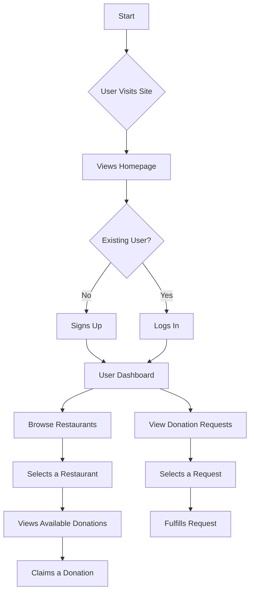
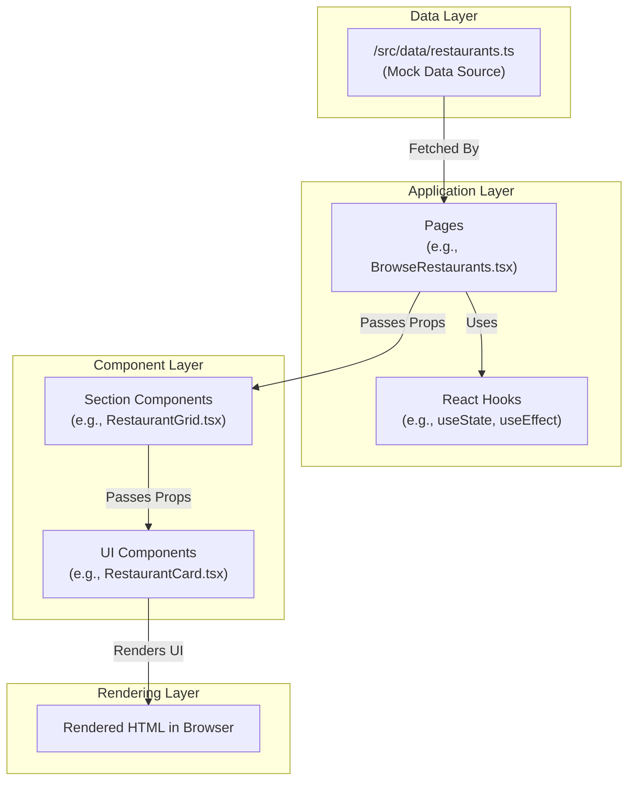

# Grub Give Back

Welcome to Grub Give Back, a modern web application designed to connect restaurants with surplus food to communities and individuals in need. This platform facilitates the process of food donation, making it easy for restaurants to contribute and for organizations to find available resources.

## ✨ Key Features

- **Browse Restaurants**: Discover participating restaurants and their available donations.
- **Real-time Donation Listings**: View up-to-date information on available food items.
- **Seamless Donation Process**: An intuitive workflow for both donating and receiving.
- **User Authentication**: Secure sign-up and login for restaurants and organizations.
- **Responsive Design**: A clean, accessible, and mobile-friendly user interface built with shadcn/ui.

## 🚀 Tech Stack & Architecture

This project leverages a modern, industry-standard tech stack to deliver a robust and scalable frontend experience.


## 📈 User Workflow

The following diagram illustrates the primary user journey within the Grub Give Back application.



## 🔄 Application & Data Flow

This diagram outlines the internal data flow, from data source to UI rendering.



## 📂 Project Structure

The codebase is organized to be modular and scalable. Here’s a brief overview of the key directories in the `src` folder:

```
/src
├── assets/         # Static assets like images and fonts
├── components/     # Reusable UI components (layout, cards, sections)
│   ├── layout/
│   ├── restaurant/
│   ├── sections/
│   └── ui/         # Core shadcn/ui components
├── data/           # Mock data and static content
├── hooks/          # Custom React hooks
├── lib/            # Utility functions and libraries
├── pages/          # Top-level page components for each route
└── ...
```

This structure separates concerns, making it easier to manage the UI, business logic, and data flow.

## 🏁 Getting Started

Follow these steps to get the project up and running on your local machine.

### Prerequisites

Make sure you have [Node.js](https://nodejs.org/) (v18 or higher) and [Bun](https://bun.sh/) installed.

### Installation & Setup

1.  **Clone the repository:**
    ```sh
    git clone <your-repository-url>
    ```

2.  **Navigate to the project directory:**
    ```sh
    cd grub-give-back
    ```

3.  **Install dependencies:**
    ```sh
    bun install
    ```
    *(Alternatively, you can use `npm install` or `yarn install`)*

### Running the Development Server

To start the local development server, run the following command:

```sh
bun run dev
```

Open your browser and navigate to `http://localhost:5173` (or the port specified in your terminal) to see the application live.

## 📜 Available Scripts

-   `bun run dev`: Starts the development server with hot-reloading.
-   `bun run build`: Bundles the application for production.
-   `bun run lint`: Lints the codebase using ESLint to ensure code quality.
-   `bun run preview`: Serves the production build locally to preview before deployment.

## 🤝 Contributing

Contributions are welcome! If you have ideas for improvements or want to fix a bug, please feel free to open an issue or submit a pull request.
